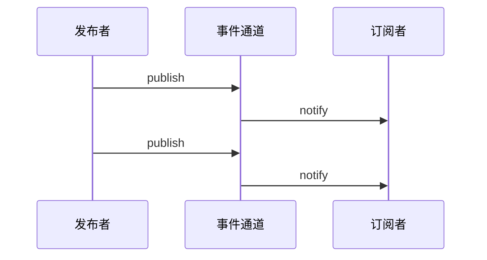

# 发布/订阅模式

## 1. 什么是发布订阅模式

发布订阅模式是一种消息范式，涉及消息的发送者（称为**发布者**）和接收者（称为**订阅者**）。在这种模式中，发布者和订阅者不直接相互了解，而是通过一个称为"**事件通道**"或"消息代理"的中间人来管理消息的分发。

这种模式提供了更好的程序解耦，增强了程序的可扩展性和可维护性。它是一种对象间一对多的依赖关系，当一个对象的状态发生改变时，所有依赖于它的对象都将得到通知。

**现实生活中的例子：**

- 报纸订阅：读者（订阅者）订阅报纸，出版社（发布者）通过邮局（事件通道）发送报纸。
- 电子邮件列表：用户订阅感兴趣的主题，当有新内容时，系统自动发送邮件给所有订阅者。
- 社交媒体：用户关注某个主题或人物，平台在有更新时推送通知。
- 股票市场：投资者订阅特定股票的价格变动，当价格变化时，系统通知所有订阅该股票的投资者。

在 JavaScript 中，发布订阅模式常用于处理异步操作和事件驱动编程，特别是在前端开发中。它是实现松耦合、可扩展系统的重要工具。

## 2. 发布订阅模式的核心概念

发布订阅模式主要包含三个核心角色：

- 发布者（Publisher）：负责创建消息，但不直接发送给订阅者。

- 订阅者（Subscriber）：对特定消息感兴趣的对象，只接收感兴趣的消息。

- 事件通道（Event Channel）：连接发布者和订阅者的中介，管理订阅关系并分发消息。

除了这三个核心角色，还有一些重要的概念：

- 主题（Topic）：消息的分类或频道，订阅者可以订阅特定的主题。
- 消息（Message）：从发布者传递到订阅者的信息载体。
- 回调函数（Callback）：订阅者提供的函数，在接收到消息时被调用。

#### 发布订阅模式的工作流程

1. 订阅者通过事件通道订阅特定类型的消息。
2. 发布者创建消息并发送到事件通道。
3. 事件通道将消息分发给所有相关的订阅者。
4. 订阅者接收并处理消息。



## 3. 实现发布订阅模式

让我们用 JavaScript 实现一个简单但功能完整的发布订阅系统：

```js
class EventEmitter {
  constructor() {
    this.events = {};
  }
  // 订阅事件
  subscribe(eventName, callback) {
    if (!this.events[eventName]) {
      this.events[eventName] = [];
    }
    this.events[eventName].push(callback);
    return () => this.unsubscribe(eventName, callback);
  }
  // 发布事件
  publish(eventName, data) {
    const eventCallbacks = this.events[eventName];
    if (eventCallbacks) {
      eventCallbacks.forEach(callback => callback(data));
    }
  }
  // 取消订阅
  unsubscribe(eventName, callback) {
    if (this.events[eventName]) {
      this.events[eventName] = this.events[eventName].filter(cb => cb !== callback);
    }
  }
  // 只订阅一次
  once(eventName, callback) {
    const onceWrapper = (...args) => {
      callback(...args);
      this.unsubscribe(eventName, onceWrapper);
    };
    return this.subscribe(eventName, onceWrapper);
  }
}
// 使用示例
const eventEmitter = new EventEmitter();
// 订阅事件
const unsubscribe = eventEmitter.subscribe('userLoggedIn', data => {
  console.log('User logged in:', data);
});
// 发布事件
eventEmitter.publish('userLoggedIn', { id: 1, name: 'John Doe' })
// 取消订阅
eventEmitter.unsubscribe();
// 只订阅一次
eventEmitter.once('oneTimeEvent', data => {
  console.log('This will only be called once:', data);
});
eventEmitter.publish('oneTimeEvent', { message: 'Hello' });
eventEmitter.publish('oneTimeEvent', { message: 'This won't be logged' });
```

这个实现包含了发布订阅模式的核心功能：订阅、发布、取消订阅，以及只订阅一次的功能。它使用了 ES6 的类语法，使代码更加清晰和易于理解。

## 4. 发布订阅模式的应用场景

发布订阅模式在前端开发中有广泛的应用，例如：

#### 1. 用户界面更新：

当数据模型发生变化时，自动更新相关的 UI 组件。

```js
// 数据模型
const dataModel = {
  data: [],
  eventEmitter: new EventEmitter(),
  updateData(newData) {
    this.data = newData;
    this.eventEmitter.publish("dataUpdated", this.data);
  },
};

// UI组件
function UIComponent() {
  dataModel.eventEmitter.subscribe("dataUpdated", (data) => {
    // 更新UI
    console.log("Updating UI with:", data);
  });
}
dataModel.updateData(xxxx);
```

#### 2. 跨组件通信：

在复杂的单页应用中，实现不同组件之间的解耦通信。


#### 3. 异步操作管理：

```js
const apiClient = {
  eventEmitter: new EventEmitter(),
  fetchData() {
    fetch("/api/data")
      .then((response) => response.json())
      .then((data) => {
        this.eventEmitter.publish("dataFetched", data);
      });
  },
};

apiClient.eventEmitter.subscribe("dataFetched", (data) => {
  console.log("Data received:", data);
});

apiClient.fetchData();
```

#### 4. 插件系统：

允许第三方开发者通过订阅特定事件来扩展应用功能。

#### 5. 状态管理：

在大型应用中管理和同步应用状态。

#### 6. 实时应用：

在聊天应用或协作工具中，当接收到新消息时通知相关组件。

## 5. 发布订阅模式 vs 观察者模式

虽然发布订阅模式和观察者模式经常被混淆，但它们有几个关键区别：

| 角度     | 观察者模式                                                  | 发布订阅模式                                                 |
| -------- | ----------------------------------------------------------- | ------------------------------------------------------------ |
| 耦合度   | 观察者和主题之间是松耦合的，但观<br/>察者需要知道主题的存在 | 发布者和订阅者完全解耦，通过事件通道通<br/>信，互不知道对方的存在 |
| 通信方式 | 主题直接通知观察者                                          | 通过中间的事件通道进行通信                                   |
| 灵活性   | 观察者需要知道主题的存在                                    | 发布者和订阅者可以完全不知道对方的存在，<br/>提供了更大的灵活性 |
| 应用场景 | 适用于组件间有明确依赖关系的场景<br/>                       | 适用于组件间完全解耦的场景，特别是在大<br/>型、复杂的系统中  |
| 复杂性   | 相对简单，直接在主题上注册观察者                            | 引入了一个额外的事件通道层，增加了一定的<br/>复杂性，但提供了更好的解耦 |
| 性能     | 可能较快，因为是直接通信                                    | 由于引入了中间层，可能会有轻微的性能开销                     |


