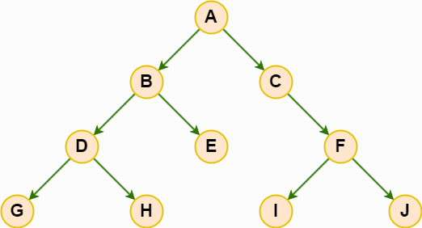

# 先序遍历、中序遍历、后序遍历

‌**先序遍历（Preorder Traversal）**‌ 是二叉树遍历的一种方式，其访问顺序为 ‌**根节点 -> 左子树 -> 右子树**‌。

这种遍历方式首先访问树的根节点，然后遍历左子树，最后遍历右子树。‌

| 类别     | 描述                                                                                                                               |
| -------- | ---------------------------------------------------------------------------------------------------------------------------------- |
| **先序遍历** | 访问**根**节点：首先访问树的根节点<br/>先序遍历**左**子树：对左子树进行先序遍历<br/>先序遍历**右**子树：对右子树进行先序遍历。 |
| **中序遍历** | ‌中序遍历**左**子树：对左子树进行中序遍历<br/>访问**根**节点：首先访问树的根节点<br/>中序遍历**右**子树：对右子树进行中序遍历。 |
| **后序遍历** | ‌后序遍历**右**子树：对右子树进行后序遍历<br/>后序遍历**左**子树：对左子树进行后序遍历<br/>访问**根**节点：首先访问树的根节点。 |

## 算法实现

### 1. 假如我们有这么一个二叉树：



```js
// 首先我们先定义一个 node对象
class node {
  constructor(name, left, right) {
    this.name = name;
    this.left = left;
    this.right = right;
  }
}
let nodeA = new node("A");
let nodeB = new node("B");
let nodeC = new node("C");
let nodeD = new node("D");
let nodeE = new node("E");
let nodeF = new node("F");
let nodeG = new node("G");
let nodeH = new node("H");
let nodeI = new node("I");
let nodeJ = new node("J");
nodeA.left = nodeB;
nodeB.left = nodeD;
nodeD.left = nodeG;
nodeA.right = nodeC;
nodeB.right = nodeE;
nodeD.right = nodeH;
nodeC.right = nodeF;
nodeF.left = nodeI;
nodeF.right = nodeJ;
```

