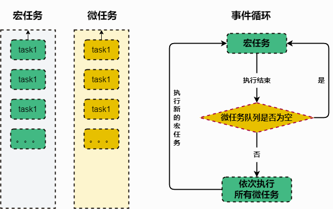

# 事件循环

**事件循环是 JavaScript 运行时环境中用来处理异步事件的机制**。它是实现 JavaScript 的单线程执行模型的核心部分。

**Web 浏览器环境中**：事件循环负责处理**用户交互事件（如点击、滚动等）**、**网络请求**、**计时器**、**定时器**、**其他异步操作（Promise 等）**等。

**Node.js 环境中**：事件循环负责处理**I/O 操作**、**网络请求**等异步任务。

事件循环的执行过程是**一个不断重复的循环**。每次循环被称为一个"**tick**"。在每个 tick 中，**事件循环会首先检查是否有待处理的异步事件**。

如果有，它们会被添加到**事件队列**中。然后，事件循环会从事件队列中取出一个事件，并且执行对应的回调函数。执行完毕后，如果事件队列中还有待处理的事件，继续取出并执行。**这个过程不断重复，直到事件队列为空**。

**这个执行模型保证了 JavaScript 代码的单线程执行，避免了多线程编程带来的竞态条件和资源共享问题**。同时，通过异步事件和回调函数的机制，JavaScript 可以处理非阻塞的 I/O 操作和其他异步任务。

理解事件循环对于编写高效和可靠的异步 JavaScript 代码非常重要。它提供了一个清晰的执行模型，帮助开发者理解异步代码的执行顺序和行为。

**事件循环图解：**

