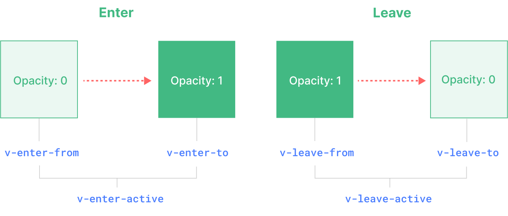

# Transition 动画

## 1. Transition 介绍

Vue 提供了两个内置组件，可以帮助你制作基于状态变化的过渡和动画：

- `<Transition>` 会在一个元素或组件进入和离开 DOM 时应用动画。
- `<TransitionGroup> ` 会在一个 v-for 列表中的元素或组件被插入，移动，或移除时应用动画。

简单地说，就是当元素发生变化，比如消失、显示时，添加动画让它更自然过渡。

它是 vue 内置组件，不需要引入注册就可以直接使用。

## 2. 默认过渡类名

transition 提供六个钩子函数，提供给我们在不同时机编写相应的动画效果。以下是此六个钩子函数执行时机

- `v-enter`：进入过渡开始状态。在元素被插入之前生效，在元素被插入之后的下一帧移除。
- `v-enter-active`：进入过渡生效时的状态。这个类可以被用来定义进入过渡的过程时间，延迟和曲线函数。
- `v-enter-to`:进入过渡的结束状态。在元素被插入之后下一帧生效 (与此同时 v-enter 被移除)，在过渡/动画完成之后移除。
- `v-leave`: 离开过渡的开始状态。在离开过渡被触发时立刻生效，下一帧被移除
- `v-leave-active`：离开过渡生效时的状态。这个类可以被用来定义离开过渡的过程时间，延迟和曲线函数。
- `v-leave-to`:离开过渡的结束状态。在离开过渡被触发之后下一帧生效 (与此同时 v-leave 被删除)，在过渡/动画完成之后移除

**图示：**



## 3. 自定义过渡类名

通过`name`可以自定义`<Transition>`的过渡类名。对应的过渡类的名字，也要随之改变

``` html
<Transition name="diy">
  <div>xxxxx</div>
</Transition>
```

``` css
.diy-enter-active,
.diy-leave-active {
  transition: opacity 0.5s ease;
}
.diy-enter-from,
.diy-leave-to {
  opacity: 0;
}
```

